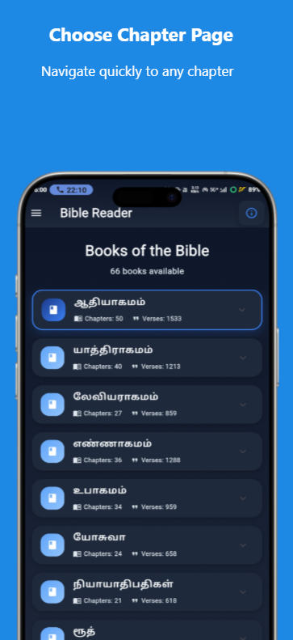
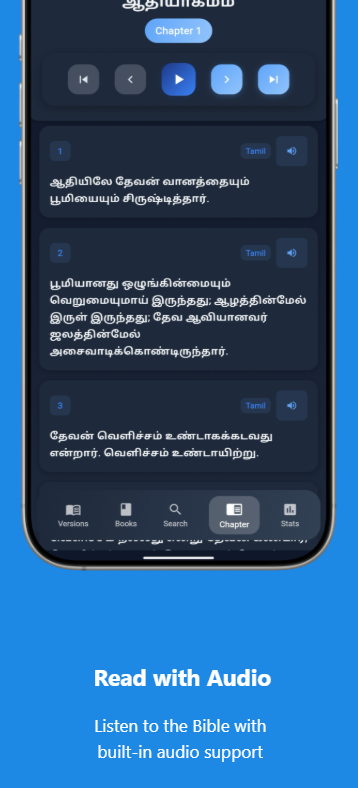
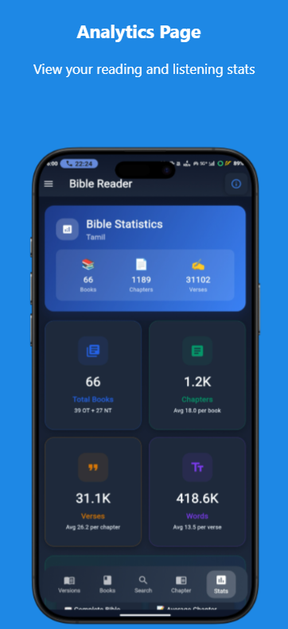

<!-- Header with logo + name inline -->
<p align="center">
  
  <span style="font-size: 2.2em; font-weight: bold; vertical-align: middle; margin-left: 10px;">Flutter Bible App</span>
</p>

<p align="center">
  <em>A modern, fast, and elegant Bible reader for Android built with Flutter</em>
</p>

<p align="center">
  <!-- Badges -->
  <a href="https://flutter.dev/"></a>
  <a href="https://dart.dev/"></a>
  
  
  
</p>

---

## 📬 Contact

**Suresh J**  
📧 Email: [youremail@example.com](mailto:youremail@example.com)  
💼 LinkedIn: [linkedin.com/in/your-handle](https://linkedin.com/in/your-handle)  
🐙 GitHub: [github.com/bevinsamraj](https://github.com/bevinsamraj)  
🌐 Website: [your-website.com](https://your-website.com)

---

## ✨ Highlights

- 📚 **Multiple Bible Versions** – Seamless switching across translations  
- 🌗 **Light & Dark Modes** – Comfortable reading anytime  
- 🔊 **Audio Bible** – Listen to scriptures on the go  
- 🔠 **Custom Fonts & Sizes** – Fine-tuned readability  
- ⚡ **Snappy Performance** – Smooth navigation & instant load  
- 🔎 **Search & Quick Jump** – Find books/chapters/verses fast  
- 🔖 **Bookmarks & Notes** – Save and reflect on verses  

---

## 📸 Screenshots

<p align="center">
  
  
  
  
</p>

---

## 🛠 Tech Stack

- **Framework:** Flutter  
- **Language:** Dart  
- **State Management:** Provider / Riverpod *(update to actual)*  
- **Audio:** just_audio / audioplayers *(update to actual)*  
- **Storage:** SharedPreferences / Hive *(update to actual)*

---

## 🚀 Quick Start

```bash
# Clone the repository
git clone https://github.com/bevinsamraj/Bible.git
cd Bible

# Install dependencies
flutter pub get

# Run the app
flutter run
